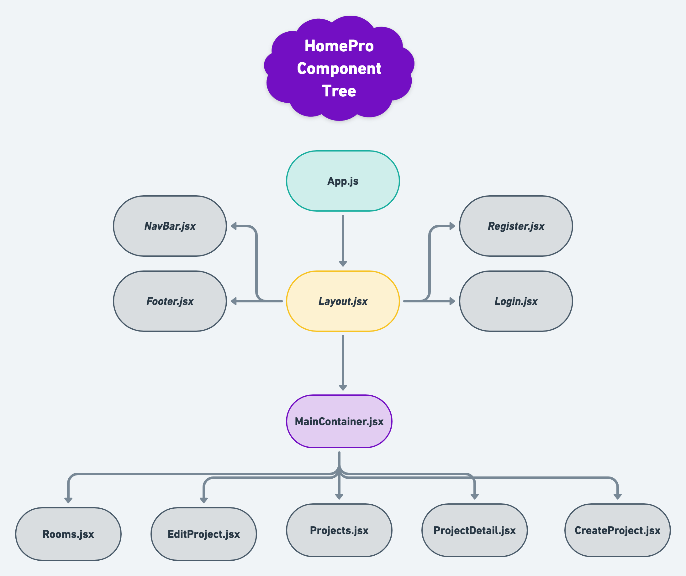
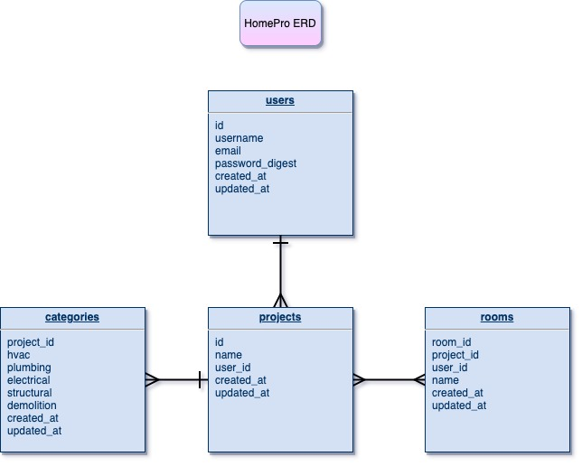

# HomePro

A website to help keep track of all your home remodeling projects.

## Overview

_**HomePro** is a website that allows a user to login and add, create, edit, or delete home remodeling projects from their user profile. Each user can choose from the "Choose Your Project" screen, and from there, can click the buttons to add, edit, or delete the specific project. The edit screen provides the option for the user to add in their own budgeted amount and choose a room for the project in the dropdown menu._

<br>

## MVP

_The **HomePro** MVP back end server will have endpoints for each user, project, and room, along with their associations. Full CRUD will be implemented with each specific project. Authentication will also be used. On the front end, MVP will consist of a fully functioning interactive React app to include responsive design and full CRUD actions._

<br>

### Goals

- _Build back end database with tables that interact with its models._
- _Implement full CRUD and authentication on front and back end._
- _Incorporate responsive design._
- _Have a modern user friendly interface._

<br>

### Libraries and Dependencies

|     Library      | Description                                                                                                                                   |
| :--------------: | :-------------------------------------------------------------------------------------------------------------------------------------------- |
|  Ruby on Rails   | _Holds back end database of users, projects, & rooms using MVC architecture._                                                                 |
| React Router Dom | _Defines routes such as /home, /login, /register, etc. to its specific component._                                                            |
|      Axios       | _Once API routes are established, axios calls for reading all projects, one project, and editing, creating, and deleting a project are made._ |
|   Material UI    | _A React UI framework to help build HomePro's screens for login, register, and choosing a project._                                           |

<br>

### Client (Front End)

#### Wireframes

[HomePro Wireframe Weblink](https://www.figma.com/file/F5nsy0W7Jd57zPeur7Mr8a/HomePro?node-id=0%3A1)


<br>
<br>
<br>

#### Component Tree

[HomePro Component Tree Weblink](https://whimsical.com/homepro-E7xrEz3JryZB48bQ9HLerg)



<br>
<br>
<br>

#### Component Architecture

```structure
client
├── README.md
├── node_modules
├── package.json
├── .gitignore
├── public
│   ├── favicon.ico
│   ├── index.html
│   └── manifest.json
└── src
    ├── assets
        ├── component-tree.png
        ├── erd.png
        ├── homepro-wireframe.png
    ├── screens
        ├── Home.jsx
        ├── Home.css
        ├── Register.jsx
        ├── Register.css
        ├── Login.jsx
        ├── Login.css
        ├── ProjectDetail.jsx
        ├── ProjectDetail.css
        ├── EditProject.jsx
        ├── EditProject.css
        ├── CreateProject.jsx
        ├── CreateProject.css
    ├── services
        ├── auth.js
        ├── config.js
        ├── projects.js
        ├── rooms.js
    ├── components
        ├── Layout.jsx
        ├── Layout.css
        ├── NavBar.jsx
        ├── NavBar.css
        ├── Footer.jsx
        ├── Footer.css
    ├── App.jsx
    ├── App.css
    ├── index.js
    ├── index.css
    ├── MainContainer.jsx
    ├── MainContainer.css
```

---

<br>

#### Time Estimates

| Task                                      | Priority | Estimated Time | Time Invested | Actual Time |
| ----------------------------------------- | :------: | :------------: | :-----------: | :---------: |
| README & Wireframe Setup                  |    H     |     5 hrs      |      TBD      |     TBD     |
| Build Server & Endpoints                  |    H     |     4 hrs      |      TBD      |     TBD     |
| Build Tables & Associations               |    H     |     4 hrs      |      TBD      |     TBD     |
| Implement Authorization                   |    H     |     5 hrs      |      TBD      |     TBD     |
| Create Back End CRUD Actions              |    H     |     5 hrs      |      TBD      |     TBD     |
| Create React App & Data Structure Setup   |    H     |      1 hr      |      TBD      |     TBD     |
| Define React State & Props Efficiently    |    H     |     3 hrs      |      TBD      |     TBD     |
| Use Data from Ruby & Render To Components |    H     |     5 hrs      |      TBD      |     TBD     |
| Create Front End CRUD Actions             |    H     |     5 hrs      |      TBD      |     TBD     |
| Style with MUI                            |    H     |     5 hrs      |      TBD      |     TBD     |
| Style with CSS                            |    H     |     3 hrs      |      TBD      |     TBD     |
| Debug & Code Cleanup                      |    H     |     3 hrs      |      TBD      |     TBD     |
| Deploy Front & Back Ends                  |    H     |      1 hr      |      TBD      |     TBD     |
| TOTAL                                     |          |     49 hrs     |      TBD      |     TBD     |

---

<br>

### Server (Back End)

#### ERD Model



<br>

---

## Post-MVP

I would like to include a budget tracker/calculator under the user's profile. I would also like to include a separate table for contractors contact information to be displayed for the specific project.

---

## Code Showcase

Brief code snippet to follow once built.

---

## Code Issues & Resolutions

A list of all major issues encountered and their resolutions to follow once website is fully built.
